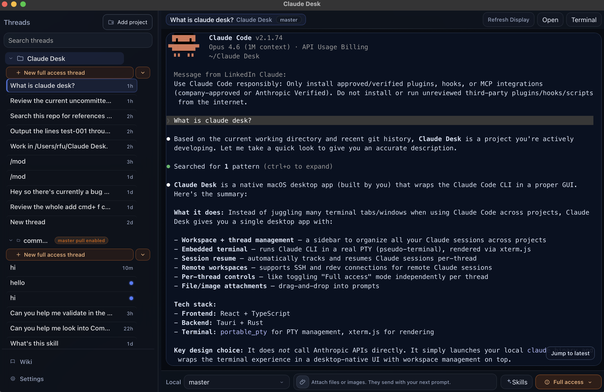

# Claude Desk

Claude Desk is a native macOS Tauri app that wraps the local Claude Code CLI in an embedded terminal UI.

The app does not call Anthropic APIs directly. It launches your local `claude` binary in an interactive PTY and renders output in-app.



## Why This Exists

Using Claude only in Terminal works well for one repo/thread, but gets painful when you juggle many:

- Too many tabs/windows across projects, with no single thread/workspace view.
- Session continuity is manual (resume ids and logs are easy to lose track of).
- Project operations (switching branches, opening folders, jumping threads) are fragmented.
- Per-thread runtime controls (like `Full access`) are harder to manage consistently.

Claude Desk solves this by keeping Claude CLI local while adding a desktop control plane:

- Workspace + thread management in one left rail.
- One-click start/resume for thread-scoped Claude sessions.
- Embedded PTY terminal behavior (ANSI, keyboard, streaming) with local log persistence.
- Attachment workflow for prompts: click `+` or drag files/images into the bottom bar, then send with your next Enter submit.
- Built-in project helpers (open folder/terminal, git branch/status context).
- Optional per-thread controls like `Full access`, plus thread-level settings such as agent/skills.

## Quick Start (No Dev Setup)

This path is for end users. You only need:

- macOS
- Claude CLI installed (`claude` on PATH, or set the path in-app)

You do **not** need Node.js, Yarn, or Rust for this install flow.

Download the latest DMG:

```bash
curl -L -o "$HOME/Downloads/Claude-Desk.dmg" "https://github.com/FuRyanf/Claude-Desk/releases/latest/download/Claude-Desk.dmg"
```

Then install + trust + launch:

```bash
bash -lc 'set -euo pipefail; DMG="$HOME/Downloads/Claude-Desk.dmg"; VOL="$(hdiutil attach "$DMG" -nobrowse | sed -n '\''s|^.*\(/Volumes/.*\)$|\1|p'\'' | head -n 1)"; trap '\''hdiutil detach "$VOL" -quiet >/dev/null 2>&1 || true'\'' EXIT; ditto "$VOL/Claude Desk.app" "/Applications/Claude Desk.app"; xattr -dr com.apple.quarantine "/Applications/Claude Desk.app" || true; open "/Applications/Claude Desk.app"'
```

Prebuilt release note:

- Current CI release artifacts are built as Apple Silicon (`aarch64`) macOS binaries.

## Development Requirements (Source Build Only)

- Node.js + Yarn
- Rust toolchain (for Tauri build)
- Claude CLI installed (`claude` on PATH or configured in app settings)

## Install

```bash
yarn install --ignore-engines
```

## Run In Development

```bash
yarn tauri dev
```

Optional frontend-only dev server:

```bash
yarn dev
```

## Build

```bash
yarn build
yarn tauri build
```

Built app output:

- `/Users/rfu/Claude Desk/src-tauri/target/release/bundle/macos/Claude Desk.app`

## Downloads

- Latest public build:
  - [Latest release](https://github.com/FuRyanf/Claude-Desk/releases/latest)
  - [Direct DMG download](https://github.com/FuRyanf/Claude-Desk/releases/latest/download/Claude-Desk.dmg)
- CI build runs (every push to `master`/`main`, every PR targeting `master`/`main`, and every `v*` tag push):
  - [Build workflow runs](https://github.com/FuRyanf/Claude-Desk/actions/workflows/build-macos.yml)
  - Each run publishes `Claude-Desk.dmg` and `Claude-Desk.app.zip` as artifacts (artifact retention is time-limited by GitHub Actions).
- For `v*` tags, the same DMG and ZIP are attached to the GitHub Release automatically.
- If signing secrets are not configured, builds are unsigned. macOS Gatekeeper may show a warning on first launch. Use Finder `Open` (or `System Settings > Privacy & Security > Open Anyway`) to run the app.

## Developer ID Signing (GitHub Actions)

The workflow supports optional macOS Developer ID signing and notarization when these repository secrets are configured:

- `APPLE_CERTIFICATE`: base64-encoded Developer ID Application `.p12`
- `APPLE_CERTIFICATE_PASSWORD`: password for that `.p12`
- `APPLE_SIGNING_IDENTITY`: certificate common name (for example `Developer ID Application: Your Name (TEAMID)`)
- `APPLE_ID`: Apple ID email used for notarization
- `APPLE_PASSWORD`: app-specific password for that Apple ID
- `APPLE_TEAM_ID`: Apple Developer Team ID
- `KEYCHAIN_PASSWORD` (optional): temporary CI keychain password

When these are present, CI imports the certificate into a temporary keychain and Tauri signs/notarizes during `tauri build`.  
When they are absent, CI still builds unsigned artifacts.

## Data Storage

Claude Desk stores data under:

- `~/Library/Application Support/ClaudeDesk/`

Important files/directories:

- `workspaces.json`
- `settings.json`
- `threads/<workspaceId>/<threadId>/thread.json`
- `threads/<workspaceId>/<threadId>/runs/<runId>/output.log`
- `threads/<workspaceId>/<threadId>/runs/<runId>/metadata.json`

## Core Runtime Model

- Workspace and thread list state is driven by persisted thread metadata.
- Selecting/opening a thread starts or resumes a PTY session for that thread.
- Threads are first-class entities; runs are children under each thread.
- Thread actions (`Rename`, `Archive`, `Delete`) mutate thread metadata/persistence only.
- Per-thread `Full access` state is persisted and applied at session start.

## Technology

Claude Desk is a three-layer local architecture:

- Frontend (`React` + `TypeScript`): manages workspace/thread UX and terminal hydration state.
- Backend (`Tauri` + `Rust`): exposes command handlers for thread persistence, PTY control, git, and settings.
- PTY layer (`portable_pty` + local shell): runs Claude in an actual pseudo-terminal and streams bytes to the UI.

Claude is started through `terminal_start_session`, which launches your login shell as `$SHELL -lic` (fallback `/bin/zsh`) and runs either:

- `claude --session-id <uuid>` for a new thread session
- `claude --resume <uuid>` for a resumed thread session
- optional `--dangerously-skip-permissions` when thread `Full access` is enabled

Terminal rendering is PTY-native: Rust reads PTY output, appends to `output.log`, emits `terminal:data` events, and the UI writes buffered chunks into `xterm.js`. On open/switch, the app hydrates from a snapshot (`terminal_read_output` / `terminal_get_last_log`) instead of replaying historical events, and temporarily defers live `terminal:data` appends for that session until snapshot hydration completes.

Session resume is thread-scoped. `thread.json` stores `claudeSessionId`, `lastResumeAt`, and `lastNewSessionAt`; startup decides new vs resumed mode from this metadata (with log-based session-id recovery fallback). If resume likely failed, the UI offers `Start fresh` (clears the saved Claude session id, then restarts).

Threads are persisted independently of live PTY processes (`thread.json` + `runs/<runId>/output.log` + `runs/<runId>/metadata.json`), so thread actions update metadata without coupling to transient runtime state.

Git integration is local CLI based (`git_tools.rs`): branch/status polling, branch switch/create, and workspace-safe session shutdown around checkout operations.

Why it stays fast:

- Minimal overhead: local CLI + PTY, no API proxy layer.
- No transcript replay requirement to paint terminal state.
- Streaming is buffered on both sides (Rust event buffering + frontend xterm buffered writes).
- State is structured by thread/workspace maps (`threadStore` for persisted metadata, `runStore` for live sessions) with refs for hot paths to avoid broad rerenders.
- Rendering avoids jitter through memoized sidebar components, resize/input debouncing, and imperative terminal writes instead of React-driven text repainting.

Local app data lives at `~/Library/Application Support/ClaudeDesk/` (workspaces, settings, thread metadata, run logs/manifests).

## Resume Behavior (High Level)

- Each thread can persist a Claude session id in `thread.json`.
- On thread open/start:
  - With prior Claude session id: launches `claude --resume <sessionId>`
  - Without one: generates a UUID and launches `claude --session-id <generatedId>`
- Startup uses login shell parity (`$SHELL -lic`, fallback `/bin/zsh`) so env/path behavior matches Terminal.
- If `Full access` is enabled for a thread, startup appends `--dangerously-skip-permissions`.

## Icons

Canonical source image:

- `/Users/rfu/Claude Desk/app icon.jpg`

Generated base icon:

- `/Users/rfu/Claude Desk/assets/icon.png`

Regenerate all icons:

```bash
yarn generate:icons
```

This updates platform icons under:

- `/Users/rfu/Claude Desk/src-tauri/icons`
- `/Users/rfu/Claude Desk/src-tauri/icons/macos`

## Verification

UI tests:

```bash
yarn test:ui
```

Full app build:

```bash
yarn tauri build
```

Optional local verification loop:

```bash
make verify
```

`make verify` runs frontend build, UI tests, Rust tests, and a Claude PTY smoke test, then writes logs under `artifacts/e2e/`.
It also writes a summary report to `artifacts/last_diagnosis.txt`.

## Troubleshooting

### Claude CLI path not detected

- Open app `Settings`.
- Set `Claude CLI Path` explicitly (for example `/usr/local/bin/claude` or your local install path).
- Re-open a thread to start a new PTY session.

### MCP works in Terminal but not in Claude Desk

- Confirm Claude Desk launches via login shell path (`$SHELL -lic`) by using the in-app diagnostics copy action.
- Compare PATH/env output between Claude Desk diagnostics and native Terminal.
- Ensure shell startup files that initialize MCP dependencies are valid (`~/.zprofile`, `~/.zshrc`, etc.).

### Permissions and Full Access mode

- Default behavior is standard Claude permission prompts.
- Enable `Full access` per-thread to launch with `--dangerously-skip-permissions`.
- Toggling `Full access` restarts the current thread session so the new mode takes effect immediately.

### Workspace add or picker issues

- Use `Add new project` and select a directory in the native folder picker.
- If picker fails/unavailable, use manual path entry in the fallback modal.
